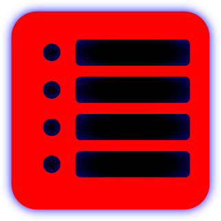

# BeatList
### Go library for beatsaber playlists

more info on playlists can be found on the [PlaylistManager](https://github.com/rithik-b/PlaylistManager/wiki) wiki page

## Library
You can load playlists using the `Load` function and save by calling `Save` or `SavePretty` on the Playlist.

## GUI
Get the latest GUI app from [Releases](/releases/latest)

[comment]: <> (##Examples)

