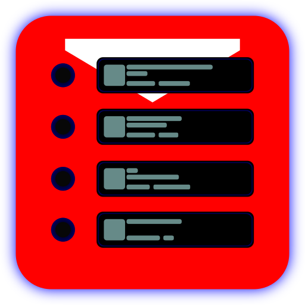
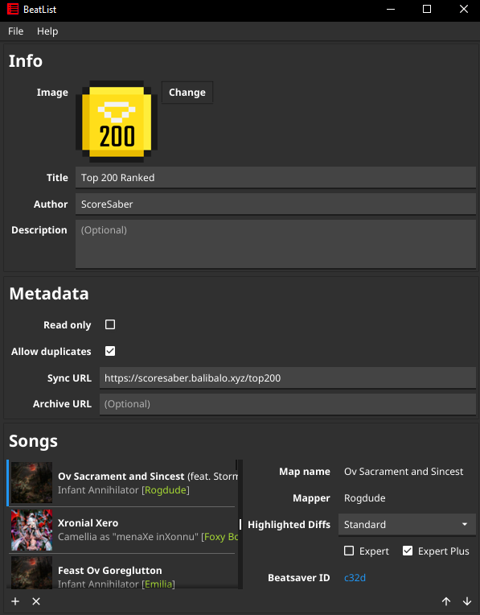

[](https://github.com/zivoy/BeatList/releases/latest)
[](https://pkg.go.dev/github.com/zivoy/BeatList/pkg/playlist)
[](https://golang.org/dl/)
[](https://github.com/fyne-io/fyne/tree/v2.0.4)

# BeatList
### Go library for beatsaber playlists


BeatList is s Beatsaber playlist creation and editing tool that can be deployed unto any device.

you can find more info on playlists on the [PlaylistManager](https://github.com/rithik-b/PlaylistManager/wiki) wiki page

## Module
You can load playlists using the `Load` function and save by calling `Save` or `SavePretty` on the Playlist.

The `Cover` type has functions for dealing with base64 encoded images.

more info in the [godoc](https://pkg.go.dev/github.com/zivoy/BeatList/pkg/playlist)

## GUI
#### if you find s bug, please report it using the `Report Bug` button in the Help menu.
Get the latest GUI app from [Releases](/releases/latest)


#### features:
- Keyboard shortcuts
  - <kbd>Ctrl</kbd> + <kbd>S</kbd> for saving current playlist
  - <kbd>Ctrl</kbd> + <kbd>O</kbd> for opening s new playlist
  - <kbd>Ctrl</kbd> + <kbd>N</kbd> for starting s new playlist
- Add songs using the `+` icon and remove them using the `x` buttons under the songlist
- Rearrange songs using the `↑` and `↓` arrows

[comment]: <> (##Examples)

### building for another distro
if you dont wish to download s binary you can also get the app using this command
```bash
go get fyne.io/fyne/v2/cmd/fyne
fyne get github.com/zivoy/BeatList/cmd/gui
```
https://github.com/GoogleCloudPlatform/golang-samples/blob/master/CONTRIBUTING.md

